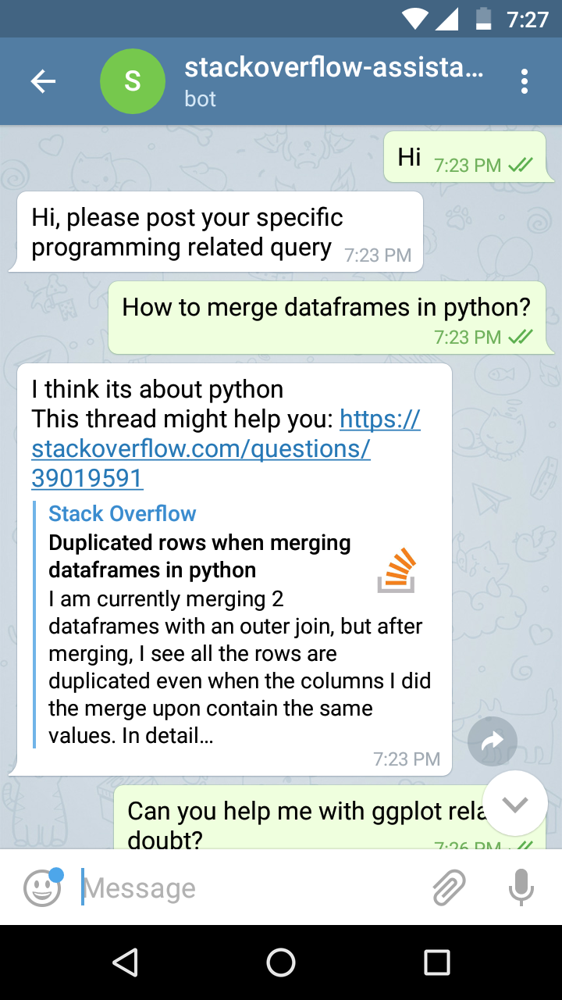
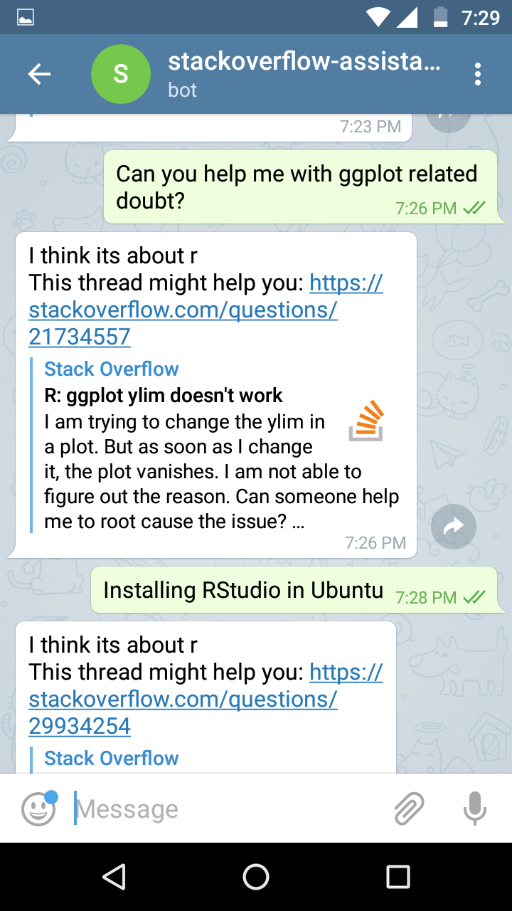

#### Introduction

Developing a conversational bot to assist user with programming queries on StackOverflow. I have integrated bot with Telegram messenger(@stackoverflow-assistant) but presently testing from my local machine only. Details of data & models used are given below.

#### Data description

- `tagged_posts.tsv` — StackOverflow posts, tagged with one programming language (*positive samples*).
- `dialogues.tsv` — dialogue phrases from movie subtitles (*negative samples*).
- `word_embeddings.tsv` — word embeddings trained earlier with [StarSpace]() on StackOverflow query data earlier.

All datasets can be downloaded from this Google Drive [link](https://drive.google.com/open?id=13_nUKGtYffmyxNbZ20BZ8zAkZYYWrFF3)

#### Models Description

As a result of this notebook `chatbot_models.ipynb`, we will obtain the following new objects that we will then use in the running bot:

- `intent_recognizer.pkl` — intent recognition model.
- `tag_classifier.pkl` — programming language classification model.
- `tfidf_vectorizer.pkl` — vectorizer used during training.
- `thread_embeddings_by_tags` — folder with thread embeddings, arranged by tags.

All model pickle files can be downloaded from this Google Drive [link](https://drive.google.com/open?id=1oROUHaWyVJvoUZT7bHTyFb3rsxh-hxvv)

#### Demo

Snapshots of bot conversation on Telegram messenger:

  
  

#### Future Scope

This is work in progress :hourglass_flowing_sand: below updates will be added in future:
1. ChatBot was designed to handle dialogues using Chatterbot but its not working due to an open issue with Chatterbot.
2. Hosting Telegram bot on AWS or any other server.
3. To use encoder-decoder-attention architecture using seq2seq architecture.

#### Credits

This project is inspired by coursera [course](https://www.coursera.org/learn/language-processing/home/welcome) on Natural Language Processing by National Research University Higher School of Economics.
